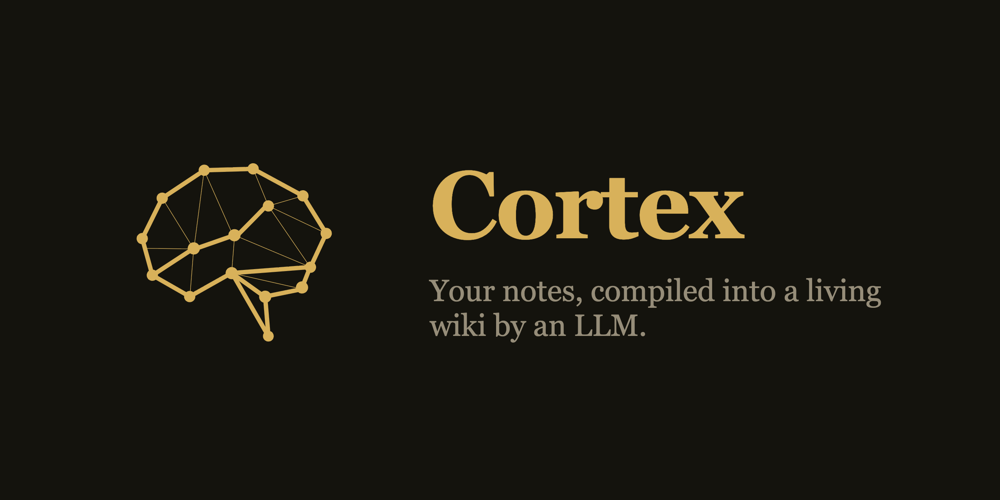
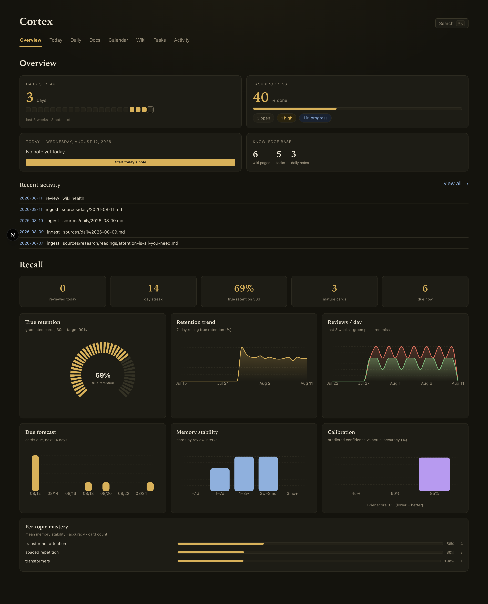
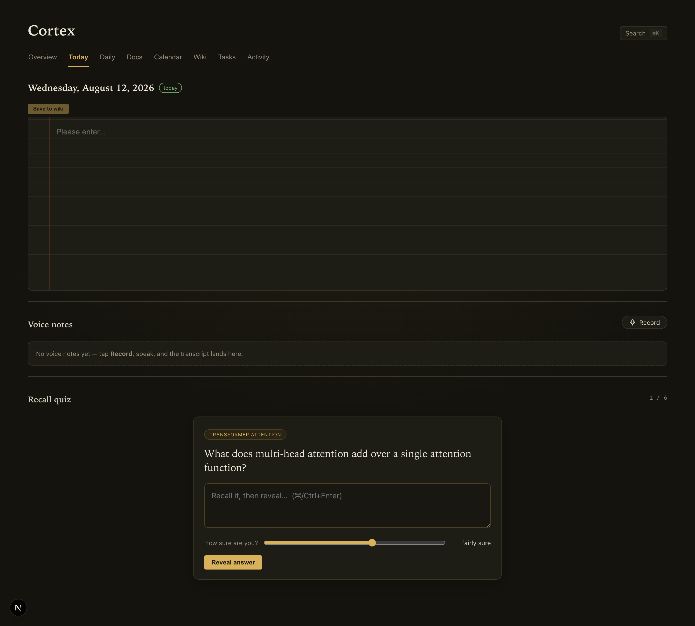
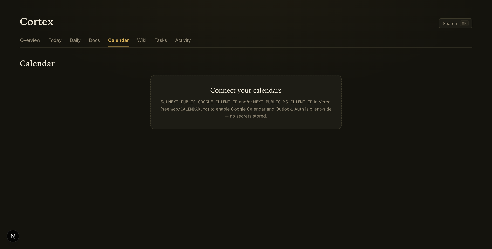
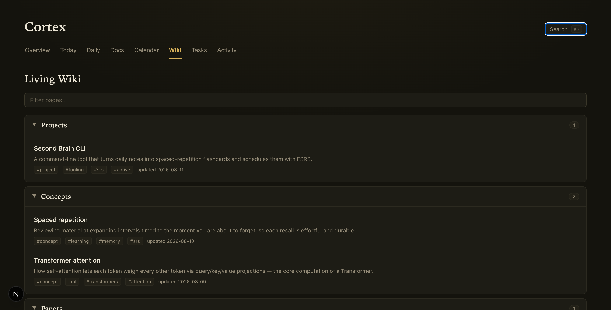
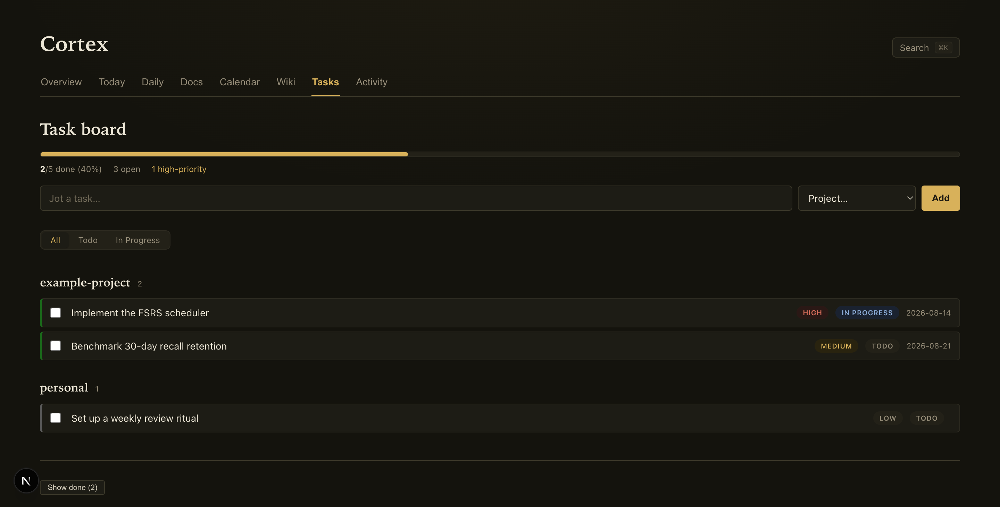

<p align="center">
  
</p>

<p align="center">
  <b><a href="#run-it">Run it</a> · <a href="#point-it-at-your-notes">Your notes</a> · <a href="#features">Features</a> · <a href="#setup">Setup</a></b>
</p>

> "Obsidian is the IDE, the LLM is the programmer, the wiki is the codebase."

You write raw notes. Claude compiles them into a linked, cited wiki. A web app, a
spaced-repetition engine, and a calendar sit on top. Git is the source of truth.

## Run it

1. `git clone https://github.com/AnikethCheluva/cortex && cd cortex/web`
2. `npm install`
3. `npm run dev`

Open http://localhost:3000. It runs on the bundled demo vault. Total time: about 2 minutes.



## Point it at your notes

Pick one. The helper writes `VAULT_PATH` to `web/.env.local`.

1. **Your own vault** — `node scripts/use-vault.mjs /path/to/your/vault` (a folder with `sources/` and `wiki/`).
2. **Empty start** — the default. Just run `npm run dev`.
3. **The worked demo** — `node scripts/use-vault.mjs examples/demo-vault`.

## How it works

```
sources/   →  INPUT.  You write raw notes, by life area.
wiki/      →  OUTPUT. Claude builds the linked, cited pages.
CLAUDE.md  →  RULES.  How sources become the wiki.
```

You never hand-edit the wiki. A new note triggers an ingest. Claude creates and
links pages, flags contradictions, and updates the index. Every claim cites a source.

## Features

| Feature | What it does |
|---|---|
| **Daily notes** | Dated notes with a rich editor, checkboxes, and inline LaTeX. |
| **Voice notes** | Dictate with the on-device Web Speech API — no key, no upload. |
| **Recall** | Keyless FSRS. Claude writes cards from your notes and grades answers. A dashboard tracks true retention. |
| **Calendar** | Google + Outlook via client-side OAuth. Plus a toggleable "Planned" overlay of project deliverables. |
| **Wiki** | Interlinked pages, one concept each, filed by type. |
| **Tasks** | A git-backed task board with projects and priorities. |
| **Docs** | Google-Docs-style long-form documents, saved as wiki sources. |
| **Clients** | Raycast, iOS Shortcuts, and a Slack bot. |

<table>
  <tr>
    <td></td>
    <td></td>
  </tr>
  <tr>
    <td></td>
    <td></td>
  </tr>
</table>

Everything is markdown and JSON in git. The web UI edits the files. See it all
populated with `node scripts/use-vault.mjs examples/demo-vault`.

## Recall never loses a day

A skipped quiz is not a failure. Cortex never grades an unanswered card.

- Miss a day → the cards stay due and come back, most-at-risk first.
- Fall behind → reviews take priority. New cards wait until you catch up.
- No ingest today → the app still builds a quiz from cards that are due now.

## Setup

Everything below is optional. The app works without it.

### Google Calendar

Full steps + Outlook: [`web/CALENDAR.md`](web/CALENDAR.md). Short version:

1. [Google Cloud Console](https://console.cloud.google.com/) → enable the **Google Calendar API**.
2. **OAuth consent screen** → *External* → add your account as a **Test user**.
3. **Credentials** → **OAuth client ID** → **Web application**. Add your origins to **Authorized JavaScript origins**: `https://<your-project>.vercel.app` and `http://localhost:3000`.
4. Set `NEXT_PUBLIC_GOOGLE_CLIENT_ID` in Vercel. Redeploy.

> **`Error 403: access_denied`?** Add your Google account as a **Test user** (step 2). Match the origin exactly — no trailing slash.

### Install on iPhone (home-screen app)

1. Open your deployed URL in **Safari**.
2. **Share** → **Add to Home Screen** → **Add**.

It launches full-screen with the dark theme. For one-tap capture, add the [iOS Shortcuts](clients/shortcuts/README.md).

### Slack bot

Full steps: [`tooling/slackbot/README.md`](tooling/slackbot/README.md). It turns `/wiki <verb>` into a headless Claude run on your vault.

### Deploy the web app

Set `GITHUB_TOKEN` + `GITHUB_REPO` so the app commits your edits. See [`web/.env.example`](web/.env.example) and [`web/DEPLOY.md`](web/DEPLOY.md).

## Layout

```
web/                 Next.js web app — the main interface
clients/             Raycast extension + iOS Shortcuts
tooling/             The Slack bot (setup + env)
.claude/             Slash commands that drive Claude's wiki work
examples/vault/      Empty starter vault (the default)
examples/demo-vault/ The worked demo (optional, deletable)
CLAUDE.md            The rules: how sources become the wiki
```

## License

MIT — see [LICENSE](LICENSE).
